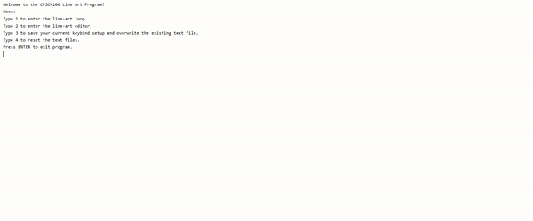
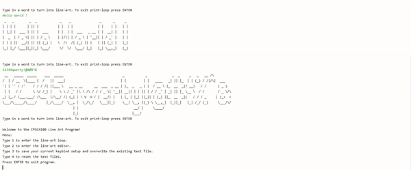

# 

This project transforms user input text into ASCII Art and displays it.
It also allows the user to create their own art and have it bound a specific character or word that can be used to showcase the new art.

## ASCII Art Demo

### Create Art Demo

